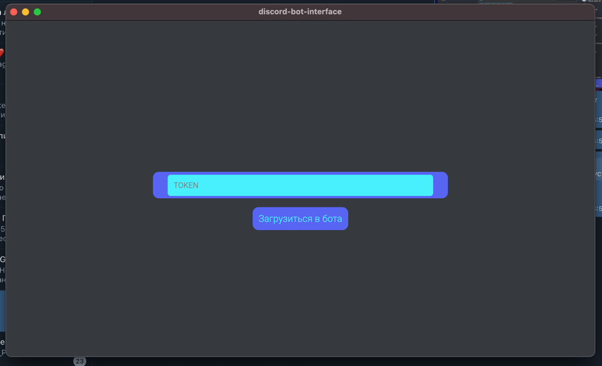
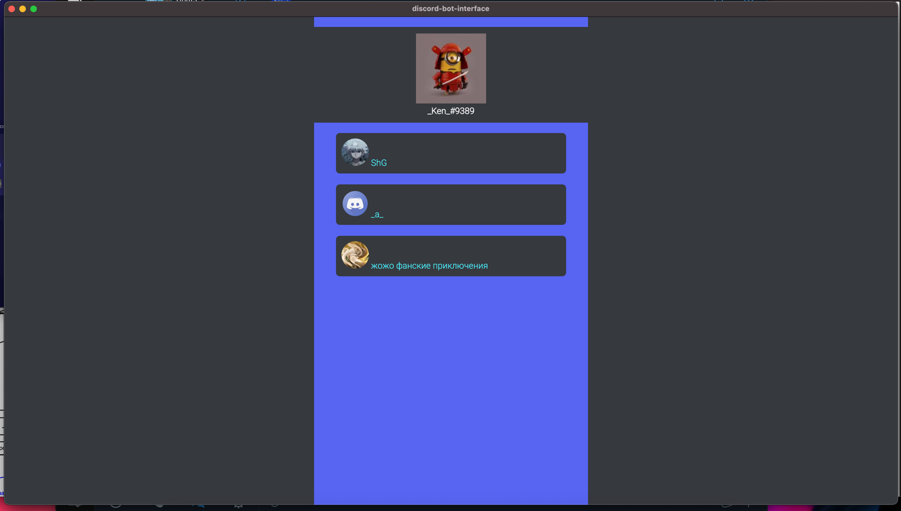
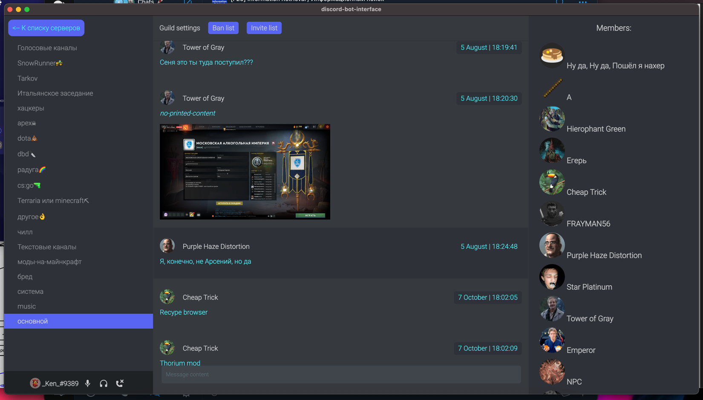

# discord-bot-interface


### Overview

**Functionality:**
- read/send messages
- connect/disconnect from voice
- add/remove roles to the member
- see ban/invite list
- see ids of members

**Planned**:
- connect with discord raid module
- properly handle errors
- listen and speak in voice chats
- fix visual problems

**Login page:**


**Guilds/servers list:**


**Guild content**:


> An electron-nuxt project

#### Build Setup

``` bash
# install dependencies
yarn install

# serve app with hot reload
yarn dev

# build electron application for production
yarn build

```

---

This project was generated with [electron-nuxt](https://github.com/michalzaq12/electron-nuxt) v1.8.1 using [vue-cli](https://github.com/vuejs/vue-cli). Documentation about the original structure can be found [here](https://github.com/michalzaq12/electron-nuxt/blob/master/README.md).
